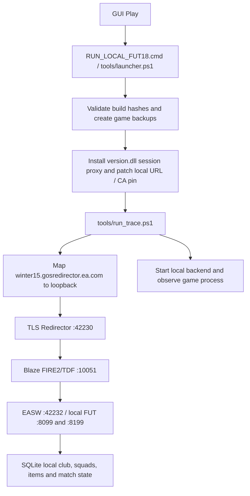

# FIFA18 → FIFA19: source investigation and implemented reuse

Inspected 2026-10-06. This report describes source behavior, not a fresh
in-game test. There is still no FIFA19 game installation in the supplied workspace.

## How the FIFA18 package reaches FUT

- `tools/launcher.ps1` calls `install_origin_patch.ps1`, then `run_trace.ps1`.
- The installer validates the game through `patch_game.py --dry-run`, backs up
  original files, installs the project's `version.dll` and genuine Windows
  `verorig.dll`, then applies the client patch.
- `patch_game.py` checks a known EXE size/hash and replaces an embedded 256-byte
  GOS certificate modulus. It replaces the EASW URL in CardsDLL and applies
  FIFA18-specific native Draft instructions.
- `client/src/version_proxy.c` forwards Version APIs, supplies local Origin
  user/persona/auth session responses and hooks game/Draft functions using
  fixed RVAs for one known FIFA18 build.
- `run_trace.ps1` owns the temporary hosts block and backend lifecycle.
- `tools/localfut18_server.py` implements redirector XML, Blaze RPCs, local
  auth/config, FUT HTTP routes and persisted SQLite state. EASW is a stub
  adapter with empty routing/content responses; it is not a full EA service.

## What FIFA19 now reuses

| Layer | FIFA19 implementation | Actual verification |
|---|---|---|
| Portable GUI / lifecycle | `Fifaback19Launcher.py`, own worker and graceful stop | Extracted Windows EXE |
| TLS Redirector | `server/localfut19.py`, separate port 42330 | Local generated certificate and XML Blaze destination |
| Blaze FIRE2/TDF | Snapshot of FIFA18 engine, instance `fifa-2019-pc`, port 10151 | Ping, PreAuth, FetchClientConfig |
| EASW adapter | Inherited handler on 42332 | Reachability only; FIFA19 schema unknown |
| FUT HTTP | FIFA19 path/session/year adaptation on 9099 and 9199 | Synthetic backend requests |
| Player definitions and starter squad | Historical FIFA19 base roster and profile | 15,462 definitions; 23 bronze starter cards |
| Saves | Independent `%LOCALAPPDATA%/FIFA19LocalFUT` SQLite | Persists across worker restart |
| Diagnostics | New `server/diagnostics.py` | All five listeners plus certificate/worker mismatch detection |
| Client file evidence | `tools/inspect_game.py` scans EXE and direct companion DLLs | Synthetic PE fixtures only; no real FIFA19 provided |
| Game routing / CA pin / EA session | Requires a verified FIFA19 build | Not implemented or verified |
| Gameplay, Draft, SBC, packs, Rivals | Remain disabled/unverified | No claim of in-game compatibility |

The inherited engine remains unchanged in this investigation. Its snapshot
hashes are recorded in `reference-manifest.json`. No FIFA18 game files, hosts
configuration or live save were modified.

## Why the FIFA18 client patch is not a FIFA19 patch

The FIFA18 proxy writes to specific EXE addresses, CardsDLL vtables and native
instruction sites. Changing filenames, year strings or port numbers does not
establish those addresses in FIFA19. Its certificate pin is also tied to the
FIFA18 executable and bundled identity, while FIFA19 currently generates its
own localhost identity per machine. A passing TLS diagnostic demonstrates
the backend certificate, not the game's trust in it.

The earlier independent reference review also reproduced an ambiguous Draft
retry that could commit an additional player. The FIFA19 HTTP adapter continues
to exclude that Draft path. Copying a bug does not establish game compatibility.

## Concrete next integration evidence

The launcher now reads PE architecture, SHA-256 and ASCII/UTF-16 endpoint/session
strings from `FIFA19.exe` and direct companion files (`CardsDLL_Win64_retail.dll`,
OriginSDK variants and `version.dll`). Its report records offsets as observations,
never as approved patch locations, and never modifies the installation.

Once an actual FIFA19 build is available, use those fingerprints to establish
the real redirector URL/port, TLS pin, session API signatures and FUT19 wire
schema. Implement a reversible, build-validated client adapter, then test native
login, club/squad rendering and match entry/settlement before marking a playable
release. Neither the diagnostic report nor the source fixtures substitute for
these game tests.
